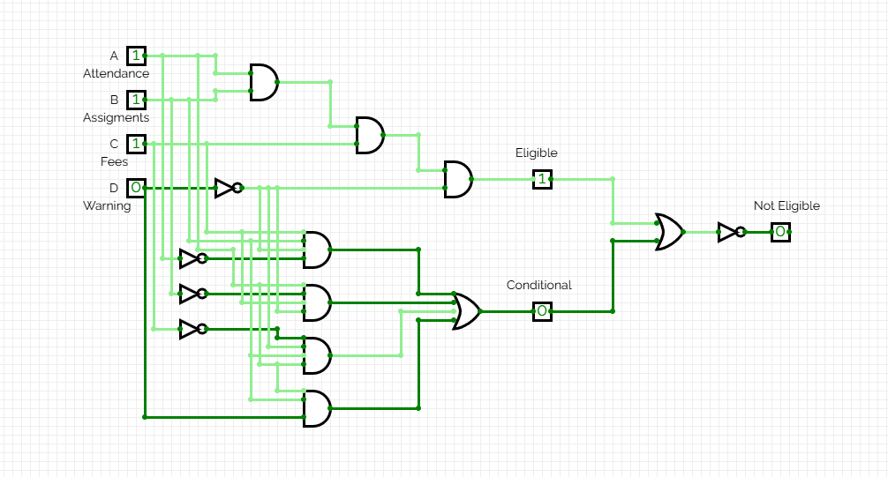
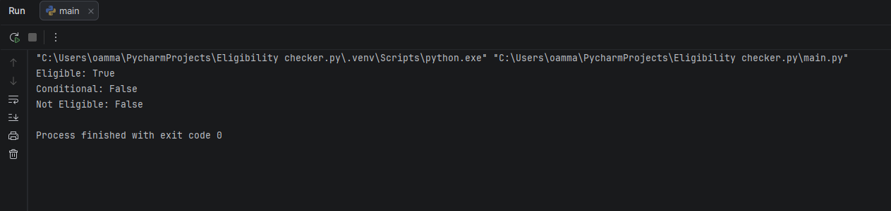
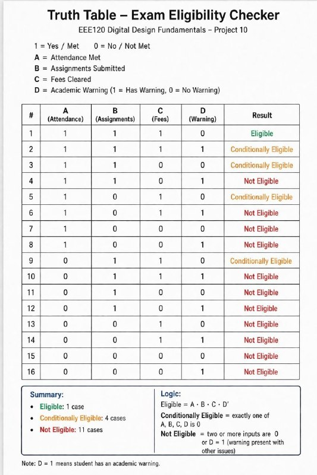

EEE120-Group-10-Final-
Final project for EEE120: Digital circuit and Python system to check exam eligibility
# EEE120 Final Project – Eligibility System
GROUP MEMBERS: 
ABDUAZIM DJAMILOV
OMAR KARIMOV 
JAFARBEK NAZAROV 
SOBIROV SUXROB​

## Description
This project implements a digital logic system to determine student eligibility.

The system checks:
- Attendance (A)
- Assignments (B)
- Fees (C)
- Academic Warning (W)

## Logic
Eligible = (A AND B AND C) AND (NOT D)
Conditional = if only one condition is missing
Not Eligible = if more than one condition is missing

## Python Extension
The Python version adds:
- Conditionally Eligible (if 2 out of 3 conditions are met)

## Demo
The system is demonstrated using:
- Digital circuit (CircuitVerse)
- Python simulation

## Circuit Link
https://circuitverse.org/users/426416/projects/final-group-10

## Example
Input: A=1, B=1, C=1, W=0  
Output: Eligible

## Boolean Expression
Eligible = A AND B AND C AND (NOT D)

## How to Run
1. Open main.py
2. Run the program
3. Change values of A, B, C, D to test different cases

## Example
Input:
A = 1
B = 1
C = 1
D = 0

Output:
Eligible = True
Conditional = False
Not Eligible = False

## Conclusion
This project demonstrates how digital logic design can be implemented both in hardware (CircuitVerse) and software (Python), producing identical results.

## Circuit Design


## Python Output


## Truth Table


## Demo Video


## Python Code

```python
def check_eligibility(A, B, C, D):
    # Eligible
    eligible = A and B and C and (not D)

    # Conditional 
    cond1 = (not A) and B and C and (not D)
    cond2 = A and (not B) and C and (not D)
    cond3 = A and B and (not C) and (not D)
    cond4 = A and B and C and D

    conditional = cond1 or cond2 or cond3 or cond4

    # Not Eligible
    not_eligible = not (eligible or conditional)

    return eligible, conditional, not_eligible


# Test
def get_input(name):
    value = input(f"{name} (1 = Yes, 0 = No): ")
    return value == "1"

A = get_input("Attendance")
B = get_input("Assignments")
C = get_input("Fees")
D = get_input("Warning")

e, c, n = check_eligibility(A, B, C, D)

print("Eligible:", e)
print("Conditional:", c)
print("Not Eligible:", n)
```

## AI Usage
AI tools were used to help generate and understand the logic and Python implementation. 
All generated content was reviewed, tested, and modified by the team.

## Outputs
- Eligible
- Conditional
- Not Eligible

## Team Members and Roles
- Omar Karimov – Python Developer + CircuitVerse Designer
- ABDUAZIM DJAMILOV – Logic Designer
- JAFARBEK NAZAROV and SOBIROV SUXROB – Documentation / Presentation

## Future Improvements
- Add a graphical user interface (GUI)
- Include more academic parameters (e.g., midterm scores)
- Connect the system to a real database
